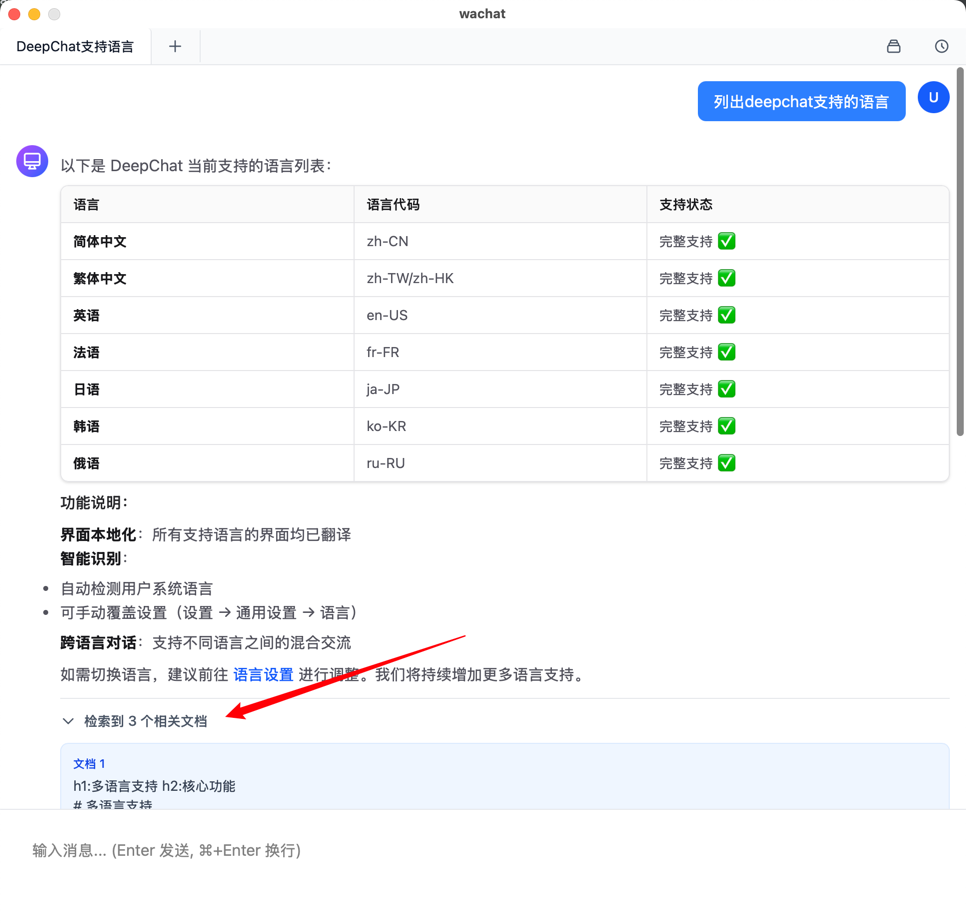

# wachat

一个基于 Wails 框架和 Vue 3 的 AI 聊天应用，提供流畅的对话体验和多Tab会话管理功能。

**wachat** = Wails AI Chat



## ✨ 特性

- 🚀 **轻量级桌面应用** - 基于 Wails 2.x，Go + Vue 3 技术栈
- 💬 **流式AI对话** - 实时流式输出，更自然的对话体验
- 🎨 **现代化 UI** - 简洁优雅的界面设计
- 📑 **多Tab管理** - 支持多个对话标签页，类似浏览器的使用体验
- 💾 **本地持久化** - SQLite 数据库存储对话历史
- 🔌 **OpenAI 兼容** - 支持 OpenAI API 和其他兼容接口
- ⚡ **Markdown 渲染** - 完美支持代码高亮和数学公式
- 📚 **RAG 知识库** - 集成 go-rag 和 Qdrant 向量数据库，支持文档检索增强对话

## 🛠 技术栈

### 后端
- **框架**: Wails v2.10.2
- **语言**: Go 1.22+
- **数据库**: SQLite (gorm)
- **AI SDK**: [Cloudwego Eino](https://github.com/cloudwego/eino) - 字节跳动开源的 LLM 应用开发框架
- **RAG**: [go-rag](https://github.com/wangle201210/go-rag) - 知识库检索增强生成系统
- **向量数据库**: [Qdrant](https://qdrant.tech/) - 高性能向量搜索引擎

### 前端
- **框架**: Vue 3.5+ (Composition API)
- **构建工具**: Vite 6
- **样式**: TailwindCSS 3
- **类型检查**: TypeScript 5.6+
- **Markdown**: vue-renderer-markdown
- **数学公式**: KaTeX
- **UI 设计**: 参考 [deepchat](https://github.com/ThinkInAIXYZ/deepchat) 的界面设计

## 📦 开发环境要求

- **Go**: 1.22 或更高版本
- **Node.js**: 20.19.0 或更高版本
- **pnpm**: 9.15.0 或更高版本
- **Wails CLI**: 2.10.2

### 安装 Wails CLI

```bash
go install github.com/wailsapp/wails/v2/cmd/wails@latest
```

## 🚀 快速开始

### 1. 克隆项目

```bash
git clone https://github.com/wangle201210/wachat.git
cd wachat
```

### 2. 安装依赖

```bash
# 安装 Go 依赖
go mod tidy

# 安装前端依赖
cd frontend
pnpm install
cd ..
```

### 3. 配置应用

创建配置文件:

```bash
cp config.example.yaml config.yaml
```

编辑 `config.yaml` 配置您的 AI 服务:

```yaml
# AI Service Configuration
ai:
  base_url: "https://api.openai.com/v1"
  api_key: "your-api-key-here"
  model: "gpt-3.5-turbo"

# RAG Configuration (Optional)
rag:
  enabled: true                     # 是否启用 RAG 功能
  auto_start: false                  # 启动时自动启动 RAG 服务
  top_k: 5                          # 检索返回的文档数量
  default_knowledge_base: ""        # 默认知识库名称
  server:
    address: ":8000"                # RAG 服务监听地址

# Qdrant Configuration (Optional)
qdrant:
  enabled: true                     # 是否启用 Qdrant
  auto_start: false                  # 启动时自动启动 Qdrant
  server:
    address: ":6333"                # Qdrant 服务地址
    grpc_address: ":6334"           # Qdrant gRPC 地址

# Binary Manager Configuration (Optional)
binaries:
  enabled: false
  use_embedded: false  # false: use local bin/, true: use embedded
  bin_path: "./bin"
  startup_order:
```

> 💡 提示：
> - 支持 OpenAI 官方 API
> - 支持其他兼容 OpenAI API 的服务（如 Ollama、Azure OpenAI 等）
> - RAG 功能可选，不需要时可设置 `rag.enabled: false`
> - 配置文件使用 YAML 格式，更易于管理和维护
> - 可以通过设置 `binaries.enabled: false` 禁用嵌入的二进制服务
> - 配置支持热重载，修改配置文件后会自动生效

### 4. 开发模式

```bash
# 启动开发服务器（热重载）
wails dev
```

> 💡 提示：如果遇到配置文件加载问题，可以设置环境变量：
> ```bash
> export WACHAT_CONFIG_PATH=/path/to/your/project
> wails dev
> ```

### 5. 构建应用

```bash
# 构建生产版本
wails build

# 特定平台构建
wails build -platform darwin/arm64   # macOS Apple Silicon
wails build -platform darwin/amd64   # macOS Intel
wails build -platform windows/amd64  # Windows
wails build -platform linux/amd64    # Linux
```

构建完成后，可执行文件位于 `build/bin/` 目录。

## 🎯 核心功能

### 1. 多Tab会话管理

- 支持打开多个对话Tab，类似浏览器标签页
- 点击 "+" 按钮创建新会话
- 每个Tab独立显示对话内容
- 关闭Tab时自动切换到相邻Tab
- 最少保持一个Tab打开

### 2. 历史记录侧边栏

- 点击右上角历史按钮打开/关闭侧边栏
- 显示所有已保存的对话
- 点击对话可快速切换当前Tab内容
- 支持删除历史对话

### 3. 懒加载对话创建

- 新建Tab时不立即创建数据库记录
- 仅在用户发送第一条消息时才保存对话
- 避免产生大量空对话记录

### 4. 流式消息输出

- AI 回复采用流式输出
- 实时显示生成的内容
- 自动滚动到最新消息

### 5. Markdown 支持

- 完整的 Markdown 语法支持
- 代码块高亮显示
- 数学公式渲染（KaTeX）

### 6. RAG 知识库管理

wachat 集成了强大的 RAG（Retrieval Augmented Generation）功能，让 AI 能够基于您的文档知识库提供更准确的回答。

#### 快速开始

1. **启用 RAG 功能**

   在 `config.yaml` 中启用 RAG：
   ```yaml
   rag:
     enabled: true
     auto_start: true
     top_k: 5
     default_knowledge_base: "my_docs"  # 设置默认知识库

   qdrant:
     enabled: true
     auto_start: true
   ```

2. **访问知识库管理**

   - 点击主界面右上角的 "知识库管理" 按钮
   - 首次使用会自动下载 go-rag 和 Qdrant 服务
   - 下载完成后点击 "启动服务"

3. **创建知识库**

   在知识库管理界面中：
   - 输入知识库名称（如 "my_docs"）
   - 点击 "创建知识库"

4. **上传文档**

   支持多种文档格式：
   - PDF 文档
   - Markdown 文件
   - HTML 网页
   - 纯文本文件

   上传方式：
   - **本地文件**: 选择文件上传
   - **网页 URL**: 输入网页地址，自动抓取内容

5. **配置检索参数**

   在知识库管理页面顶部：
   - **TopK**: 每次检索返回的文档数量（1-100）
   - **默认知识库**: 选择对话时使用的知识库

6. **开始对话**

   配置完成后：
   - 返回聊天界面
   - 发送消息时，AI 会自动从知识库检索相关内容
   - 基于检索到的文档提供更准确的回答

## 📝 开发说明

### 数据库

应用使用 SQLite 存储数据，数据库文件位于用户目录：
- **macOS/Linux**: `~/.wachat/chat.db`
- **Windows**: `%USERPROFILE%\.wachat\chat.db`

数据库包含两张表：
- `conversations` - 存储会话信息
- `messages` - 存储消息记录

### 事件系统

前端通过 Wails Runtime 监听后端事件：

- `stream:start` - 流式响应开始
- `stream:response` - 接收流式内容块
- `stream:end` - 流式响应结束
- `stream:error` - 流式响应错误
- `conversation:title-updated` - 会话标题更新

## 🐛 常见问题

### Q: 如何更换 AI 服务提供商？

A: 修改 `config.yaml` 文件中的配置：

```yaml
# 使用 Ollama 本地模型
ai:
  base_url: "http://localhost:11434/v1/chat/completions"
  api_key: ""
  model: "llama2"

# 使用 Azure OpenAI
ai:
  base_url: "https://your-resource.openai.azure.com/openai/deployments/your-deployment/chat/completions?api-version=2024-02-15-preview"
  api_key: "your-azure-key"
  model: "gpt-35-turbo"

# 使用 SiliconFlow (DeepSeek)
ai:
  base_url: "https://api.siliconflow.cn/v1"
  api_key: "sk-your-key-here"
  model: "deepseek-ai/DeepSeek-V3"
```

### Q: 如何清空所有对话？

A: 直接删除数据库文件：

```bash
# macOS/Linux
rm ~/.wachat/chat.db

# Windows (PowerShell)
Remove-Item $env:USERPROFILE\.wachat\chat.db
```

### Q: 开发模式下修改代码后没有热重载？

A:
- Go 代码修改需要重启 `wails dev`
- Vue 代码修改会自动热重载
- 如果遇到问题，尝试清理缓存：`rm -rf frontend/dist`

### Q: 如何使用 RAG 知识库功能？

A:
1. 在 `config.yaml` 中启用 RAG 和 Qdrant
2. 点击主界面右上角的 "知识库管理" 按钮
3. 首次使用会下载必要的服务（go-rag 和 Qdrant）
4. 启动服务后，创建知识库并上传文档
5. 在顶部设置栏选择默认知识库
6. 返回聊天界面，AI 会自动使用知识库内容

### Q: RAG 服务无法启动怎么办？

A:
- **检查端口占用**: 确保端口 8000（go-rag）和 6333（Qdrant）没有被占用
- **检查配置**: 确认 `config.yaml` 中的配置正确
- **查看日志**: 在应用日志中查看具体错误信息
- **手动清理**: 删除 `~/.wachat/go-rag` 和 `~/.wachat/qdrant` 目录后重新下载

### Q: 知识库文档支持哪些格式？

A: 目前支持：
- PDF 文档（.pdf）
- Markdown 文件（.md）
- HTML 网页（.html）
- 纯文本文件（.txt）
- 网页 URL（自动抓取内容）

### Q: 如何提高 RAG 检索的准确性？

A:
1. 使用清晰、具体的问题
2. 调整 `top_k` 参数（增加返回的文档数量）
3. 确保上传的文档内容质量高、结构清晰
4. 使用支持 embedding 的高质量 AI 模型
5. 为不同主题创建独立的知识库

## 🗺 开发路线图

- [x] 基础聊天功能
- [x] 多Tab会话管理
- [x] 本地数据持久化
- [x] 流式消息输出
- [x] Markdown 和代码高亮
- [x] RAG 知识库集成
- [x] Qdrant 向量数据库
- [x] 文档上传和索引
- [x] 知识库管理界面
- [x] 配置热重载
- [ ] 消息编辑和重新生成
- [ ] 对话导出（JSON/Markdown）
- [ ] 主题切换（深色/浅色）
- [ ] 系统提示词设置
- [ ] 模型参数调整（temperature、max_tokens等）
- [ ] 快捷键支持
- [ ] 多语言国际化
- [ ] RAG 检索结果展示
- [ ] 知识库导出/导入

## 🙏 致谢

- [Wails](https://github.com/wailsapp/wails) - 优秀的 Go + Web 框架
- [Vue.js](https://github.com/vuejs/core) - 渐进式 JavaScript 框架
- [Cloudwego Eino](https://github.com/cloudwego/eino) - 字节跳动开源的 LLM 应用开发框架，提供统一的 AI 接入能力
- [go-rag](https://github.com/wangle201210/go-rag) - 基于 Go 的 RAG 系统，提供知识库检索增强能力
- [Qdrant](https://qdrant.tech/) - 高性能向量搜索引擎，为 RAG 提供向量存储和检索
- [deepchat](https://github.com/ThinkInAIXYZ/deepchat) - UI 设计参考，提供了优秀的聊天界面设计灵感

## 📮 联系方式

如有问题或建议，欢迎提交 [Issue](https://github.com/wangle201210/wachat/issues)。

---

**Made with ❤️ using Wails and Vue**
